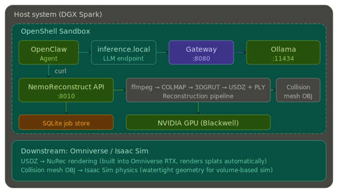

<div align="center">

# NemoReconstruct

**A fully local 3D reconstruction pipeline — from video to Omniverse-ready scenes — orchestrated by AI agents in secure sandboxes.**

[](https://www.python.org/downloads/)
[](https://fastapi.tiangolo.com)
[](https://nextjs.org)
[](LICENSE)

[Quick Start](#quick-start) · [Architecture](#architecture) · [API Reference](#api-reference) · [Datasets](#datasets) · [NemoClaw Agent](#nemoclaw-agent-orchestrator) · [Setup Guide](nemoclaw/NEMOCLAW_SETUP.md)

</div>

---

NemoReconstruct turns video into physics-ready 3D scenes. The pipeline extracts frames with **ffmpeg**, reconstructs camera poses with **COLMAP**, trains neural 3D Gaussians via [**3DGRUT**](https://github.com/nv-tlabs/3DGRUT) or [**fVDB**](https://github.com/openvdb/fvdb-core), and exports **NuRec USDZ** assets with collision meshes for [NVIDIA Isaac Sim](https://developer.nvidia.com/isaac-sim).

An LLM-powered agent (**NemoClaw**) drives the pipeline end-to-end: it starts jobs via the API, monitors progress, evaluates output quality (PSNR, SSIM), and iterates with tuned parameters — all running locally inside an [OpenShell](https://github.com/NVIDIA/OpenShell) sandbox with [Ollama](https://ollama.com) inference.

> **This repo is also a template.** The [setup guide](nemoclaw/NEMOCLAW_SETUP.md) shows how to pair NemoClaw + OpenShell with **any** repo or API — NemoReconstruct is the reference implementation.

<br>

## Architecture

<div align="center">


*Everything runs on one machine — no cloud calls leave the host.*
</div>

| Component | Port | Purpose |
|-----------|------|---------|
| Ollama | 11434 | Local LLM inference (`glm-4.7-flash`) |
| OpenShell Gateway | 8080 | Sandbox management and inference routing |
| NemoReconstruct API | 8010 | FastAPI pipeline server |
| Next.js Frontend | 3000 | Upload dashboard (optional) |

<br>

## Quick Start

### Prerequisites

- Linux with NVIDIA GPU and CUDA toolkit
- Docker
- Python 3.10+
- Node.js 18+

> For step-by-step prerequisite installation, see the [full setup guide](nemoclaw/NEMOCLAW_SETUP.md).

### 1. Clone and Install

```bash
git clone https://github.com/clayton-littlejohn/NemoReconstruct.git
cd NemoReconstruct
make setup          # creates .venv, installs Python + Node deps
```

### 2. Download a Dataset (Optional)

```bash
./scripts/download_datasets.sh garden    # downloads garden scene (~2.8 GB)
make list-datasets                       # see all available scenes
```

Or bring your own video — `.mp4`, `.mov`, and `.avi` files are supported.

### 3. Start the Backend

```bash
make backend-dev    # FastAPI on 0.0.0.0:8010, auto-reloads on change
```

### 4. Set Up OpenShell + Ollama

```bash
openshell gateway start --gpu

openshell provider create --name ollama --type openai \
  --credential OPENAI_API_KEY=empty \
  --config OPENAI_BASE_URL=http://host.openshell.internal:11434/v1

openshell inference set --provider ollama --model glm-4.7-flash
```

### 5. Run the Agent

```bash
openshell sandbox create \
  --from openclaw \
  --policy nemoclaw/sandbox-policy.yaml \
  --upload "$PWD:/sandbox/NemoReconstruct" \
  -- bash -c '
mkdir -p /sandbox/.openclaw
cp /sandbox/NemoReconstruct/nemoclaw/sandbox-openclaw.json /sandbox/.openclaw/openclaw.json
export OPENAI_API_KEY=unused
cd /sandbox/NemoReconstruct
openclaw agent --local --session-id demo \
  --message "List all reconstruction jobs. Use curl to call the API at http://172.20.0.1:8010" \
  --json --timeout 120
'
```

> **Full tutorial:** [nemoclaw/NEMOCLAW_SETUP.md](nemoclaw/NEMOCLAW_SETUP.md) — covers every step from a fresh machine and shows how to adapt this for your own project.

<br>

## What the Agent Can Do

| Capability | Description |
|------------|-------------|
| **Upload and reconstruct** | Upload videos or select Mip-NeRF 360 dataset scenes |
| **Tune parameters** | Adjust iterations, downsample factor, render method, quality presets |
| **Monitor progress** | Poll job status and training metrics in real time |
| **Download outputs** | Retrieve NuRec USDZ, PLY splat, and collision mesh artifacts |
| **Self-iterate** | Evaluate PSNR/SSIM metrics and retry with improved parameters |
| **Inspect state** | Access logs, system state, and pipeline details via shell |

<br>

## Project Structure

```
backend/            FastAPI API server, SQLite job store, background runner
frontend/           Next.js dashboard for uploads and monitoring
scripts/            Dataset download and setup utilities
sdk/python/         Python client library
sdk/typescript/     TypeScript client library
nemoclaw/           Agent config, prompts, sandbox policy, orchestrator
data/               Downloaded dataset scenes (git-ignored)
```

<br>

## Datasets

NemoReconstruct supports the [Mip-NeRF 360](https://jonbarron.info/mipnerf360/) benchmark for testing without your own video.

```bash
make download-datasets                      # all 7 scenes (~12 GB)
./scripts/download_datasets.sh garden room  # specific scenes only
make list-datasets                          # check download status
```

| Scene | Type | Images | Size |
|-------|------|--------|------|
| bicycle | outdoor | 291 | ~2.3 GB |
| bonsai | indoor | 311 | ~1.3 GB |
| counter | indoor | 312 | ~1.2 GB |
| garden | outdoor | 185 | ~2.8 GB |
| kitchen | indoor | 315 | ~1.5 GB |
| room | indoor | 311 | ~1.3 GB |
| stump | outdoor | 295 | ~1.4 GB |

Each scene includes full-resolution images, COLMAP sparse models, and pre-computed downsampled image sets (`images_2/`, `images_4/`, `images_8/`). Downloaded scenes appear in the frontend dashboard under the **Dataset** tab.

<br>

## API Reference

Interactive docs are available at [`/docs`](http://localhost:8010/docs) when the backend is running. Generate the OpenAPI schema locally with `make openapi`.

### Reconstruction Endpoints

| Method | Endpoint | Description |
|--------|----------|-------------|
| `POST` | `/api/v1/reconstructions/upload` | Upload video and start reconstruction |
| `POST` | `/api/v1/reconstructions/from-dataset` | Start reconstruction from a dataset scene |
| `GET` | `/api/v1/reconstructions` | List all jobs |
| `GET` | `/api/v1/reconstructions/{id}` | Job details |
| `GET` | `/api/v1/reconstructions/{id}/status` | Poll status and progress |
| `GET` | `/api/v1/reconstructions/{id}/artifacts` | List downloadable artifacts |
| `GET` | `/api/v1/reconstructions/{id}/download/{artifact}` | Download artifact (PLY, USDZ, mesh) |
| `GET` | `/api/v1/reconstructions/{id}/metrics` | Training metrics (loss, PSNR, SSIM) |
| `GET` | `/api/v1/reconstructions/{id}/iterations` | Iteration history with verdicts |
| `POST` | `/api/v1/reconstructions/{id}/retry` | Retry with new parameters |
| `DELETE` | `/api/v1/reconstructions/{id}` | Delete a job |

### Workflow Endpoints

| Method | Endpoint | Description |
|--------|----------|-------------|
| `POST` | `/api/v1/workflows/start` | Start agent workflow (video upload) |
| `POST` | `/api/v1/workflows/start-from-dataset` | Start agent workflow (dataset) |
| `GET` | `/api/v1/workflows` | List all workflows |
| `GET` | `/api/v1/workflows/{id}` | Workflow details |
| `POST` | `/api/v1/workflows/{id}/stop` | Stop a running workflow |
| `DELETE` | `/api/v1/workflows/{id}` | Delete a workflow |

### Utility Endpoints

| Method | Endpoint | Description |
|--------|----------|-------------|
| `GET` | `/health` | Health check |
| `GET` | `/api/v1/pipelines` | List available pipelines |
| `GET` | `/api/v1/datasets` | List available dataset scenes |

<br>

## Tunable Parameters

Pass these when creating a reconstruction via upload or dataset endpoints:

| Parameter | Range | Default | Description |
|-----------|-------|---------|-------------|
| `frame_rate` | 0.25 – 12.0 | 2.0 | Frames/sec extracted from video |
| `reconstruction_backend` | `3dgrut` / `fvdb` | `fvdb` | Neural reconstruction backend |
| `sequential_matcher_overlap` | 2 – 50 | 12 | COLMAP sequential matcher overlap |
| `colmap_mapper_type` | `incremental` / `global` | `incremental` | COLMAP mapper (`global` uses GLOMAP) |
| `colmap_max_num_features` | 1,000 – 32,768 | 8,192 | Max SIFT features per image |
| `grut_n_iterations` | 1,000 – 100,000 | 30,000 | 3DGRUT training iterations |
| `grut_render_method` | `3dgrt` / `3dgut` | `3dgrt` | 3DGRUT render method |
| `grut_strategy` | `gs` / `mcmc` | `gs` | 3DGRUT densification strategy |
| `grut_downsample_factor` | 1 – 12 | 2 | Image downsampling for 3DGRUT |
| `fvdb_max_epochs` | 5 – 500 | 40 | fVDB training epochs |
| `fvdb_sh_degree` | 0 – 4 | 3 | Spherical harmonics degree |
| `fvdb_image_downsample_factor` | 1 – 12 | 6 | Image downsampling for fVDB |
| `splat_only_mode` | `true` / `false` | `false` | Skip USDZ export, produce PLY only |
| `collision_mesh_enabled` | `true` / `false` | `true` | Generate collision mesh from PLY |
| `collision_mesh_method` | `alpha` / `convex_hull` | `alpha` | Collision mesh generation algorithm |

<br>

## Manual Usage (Without Agent)

### Upload a video

```bash
curl -s -X POST http://localhost:8010/api/v1/reconstructions/upload \
  -F "file=@/path/to/video.MOV" \
  -F "name=my-scene" \
  -F "frame_rate=2.0" \
  -F "reconstruction_backend=3dgrut" \
  -F "grut_n_iterations=30000"
```

### Poll status

```bash
curl -s http://localhost:8010/api/v1/reconstructions/<id>/status
```

### Download the PLY

```bash
curl -L -o output.ply \
  http://localhost:8010/api/v1/reconstructions/<id>/download/splat_ply
```

### Python SDK

```python
from nemo_reconstruct_client import NemoReconstructClient

client = NemoReconstructClient("http://localhost:8010")
job = client.upload_video("/tmp/scene.mov", "my-scene",
    params={"reconstruction_backend": "3dgrut", "grut_n_iterations": 30000})
result = client.wait_for_completion(job.id)
print(client.get_artifacts(job.id))
```

<br>

## NemoClaw Agent Orchestrator

NemoClaw is the agentic orchestration layer that drives multi-iteration reconstruction workflows. It uses a local LLM (via Ollama) running inside an OpenShell sandbox to autonomously start jobs, evaluate quality, and retry with tuned parameters.

```bash
# Run the orchestrator with a video (max 3 iterations)
./nemoclaw/orchestrate.sh ~/video.MOV "my-scene" 3

# Run with a pre-downloaded dataset
./nemoclaw/orchestrate.sh --dataset garden "garden-test" 3
```

### Configuration Files

| File | Purpose |
|------|---------|
| [`nemoclaw/orchestrate.sh`](nemoclaw/orchestrate.sh) | Main loop — reconstruct, evaluate, retry |
| [`nemoclaw/agent-prompt.md`](nemoclaw/agent-prompt.md) | Evaluator system prompt with quality thresholds |
| [`nemoclaw/sandbox-policy.yaml`](nemoclaw/sandbox-policy.yaml) | OpenShell network and filesystem isolation rules |
| [`nemoclaw/sandbox-openclaw.json`](nemoclaw/sandbox-openclaw.json) | OpenClaw agent config (model, tools, workspace) |

> **Adapting for your own project?** The [setup guide](nemoclaw/NEMOCLAW_SETUP.md) includes generic sandbox policy and OpenClaw config templates you can copy and customize.

### Environment Variables

| Variable | Default | Description |
|----------|---------|-------------|
| `OLLAMA_URL` | `http://127.0.0.1:11434` | Ollama inference endpoint |
| `OLLAMA_MODEL` | `glm-4.7-flash` | LLM model for agent reasoning |
| `AGENT_TIMEOUT` | `300` | Agent execution timeout (seconds) |
| `ACCEPT_PSNR_THRESHOLD` | `25.0` | PSNR threshold to accept a result |
| `ACCEPT_SSIM_THRESHOLD` | `0.85` | SSIM threshold to accept a result |
| `API_URL` | `http://127.0.0.1:8010` | Backend API endpoint |

### Using This as a Template

The [setup guide](nemoclaw/NEMOCLAW_SETUP.md) (Part 2) walks through connecting NemoClaw to any project:

1. Start your service on `0.0.0.0` (not `127.0.0.1`)
2. Create a sandbox policy allowing access to your service port
3. Create an OpenClaw config pointing to your workspace
4. Run the agent with the same `openshell sandbox create` pattern

The NemoClaw + OpenShell infrastructure (Ollama, gateway, provider, inference routing) is set up once and reused across all projects.

<br>

## Development

```bash
make setup              # one-time: create .venv, install all deps
make backend-dev        # start FastAPI dev server (port 8010, auto-reload)
make frontend-dev       # start Next.js dev server (port 3000)
make openapi            # regenerate OpenAPI schema
```

### System Requirements

Pipeline binaries (must be on `PATH` or configured via env vars with `NEMO_RECONSTRUCT_` prefix):

- **ffmpeg** — Video frame extraction
- **COLMAP** — Feature extraction, matching, sparse reconstruction
- **fVDB / `frgs`** — fVDB Reality Capture (default backend)
- **3DGRUT** — Neural Gaussian reconstruction + NuRec USDZ export (alternative backend)
- **CUDA toolkit** — Headers at `/usr/local/cuda` for JIT C++ extension builds

All paths are configurable via environment variables or a `.env` file in the backend directory.

<br>

## Known Limitations

- **DGX Spark (aarch64):** fVDB's stub `pxr` package lacks `usd-core` — a workaround uses 3DGRUT's environment for PLY-to-USDZ conversion.
- **Ollama models:** `nemotron-3-nano` may crash on some platforms; `glm-4.7-flash` is recommended.
- **PyTorch CC 12.1 warning:** Harmless — 3DGRUT CUDA kernels still JIT-compile correctly.

<br>

## Contributing

Contributions are welcome! Please open an issue to discuss proposed changes before submitting a pull request.

1. Fork the repository
2. Create a feature branch (`git checkout -b feature/my-feature`)
3. Commit your changes (`git commit -m 'Add my feature'`)
4. Push to the branch (`git push origin feature/my-feature`)
5. Open a Pull Request

<br>

## References

### Research Papers

- **Mip-NeRF 360** — Barron et al. *"Mip-NeRF 360: Unbounded Anti-Aliased Neural Radiance Fields."* CVPR, 2022. [[arXiv](https://arxiv.org/abs/2111.12077)]
- **3D Gaussian Splatting** — Kerbl et al. *"3D Gaussian Splatting for Real-Time Radiance Field Rendering."* ACM TOG (SIGGRAPH), 2023. [[arXiv](https://arxiv.org/abs/2308.04079)]
- **3DGRT** — Moenne-Loccoz et al. *"3D Gaussian Ray Tracing: Fast Tracing of Particle Scenes."* ACM TOG (SIGGRAPH Asia), 2024.
- **3DGUT** — Wu et al. *"3DGUT: Enabling Distorted Cameras and Secondary Rays in Gaussian Splatting."* CVPR, 2025.
- **fVDB** — Williams et al. *"fVDB: A Deep-Learning Framework for Sparse, Large-Scale, and High-Performance Spatial Intelligence."* ACM TOG (SIGGRAPH), 2024. [[arXiv](https://arxiv.org/abs/2407.01781)]
- **COLMAP** — Schönberger & Frahm. *"Structure-from-Motion Revisited."* CVPR, 2016. [[Code](https://github.com/colmap/colmap)]

### Tools and Platforms

- [3DGRUT](https://github.com/nv-tlabs/3dgrut) — 3D Gaussian Ray Tracing Unified Toolkit (NVIDIA)
- [OpenShell](https://github.com/NVIDIA/OpenShell) — Secure sandboxed runtime for AI agents
- [OpenClaw](https://docs.openclaw.ai/) — Self-hosted AI agent gateway
- [Ollama](https://ollama.com) — Local LLM inference server
- [COLMAP](https://colmap.github.io/) — Structure-from-Motion and Multi-View Stereo

<br>

## License

This project is licensed under the Apache License 2.0. See the [LICENSE](LICENSE) file for details.
